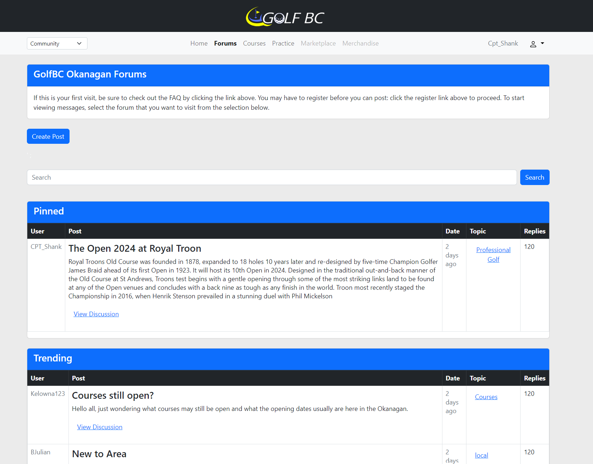

# GolfBC
## Description
The goal of this platform is to create an one-stop shop for the local golf community. With infomation scattered across dozens of apps, newspapers, local blogs and groups finding your local information can be challenging. 
## Technical
The website has been developed using XAMPP and written using Apache, PHP, MySQL and Javascript. Nearly all information is pulled stored and pulled from the database. Ajax is also used pull information asynchronously. There are still many functionalities that need to be incorporated and bugs to be fixed.
## Homepage
The information I'm aiming to provide is a homepage with community updates, articles written by local enthusiast's and current events. 

## Forum
The forum section is a way to bring the local golf community together from events and swing help, to club talk and finding new friends to play with. 

## Courses
The courses section that has a list of all courses within the area, with filtering and review functionalities, and a page for each course containing all its information. 

## Practice
The practice page is similar to the courses page but a resource for local driving ranges, simulators and instructors. 

## Marketplace
Of course there will always be other local options to use as a way of finding new or used gear. However, this platform deters the agony of scrolling other used gear sites and finding that perfect set, only to realize its a four hour drive away. A localized marketplace will also deter scamming and the uneasy feeling when using large platforms. 

## Accounts
Each user will have there own account, used for postings to forums, marketplace etc. I also aim to have customization for each where you can upload photos, display your gear and scores if you wish. 

